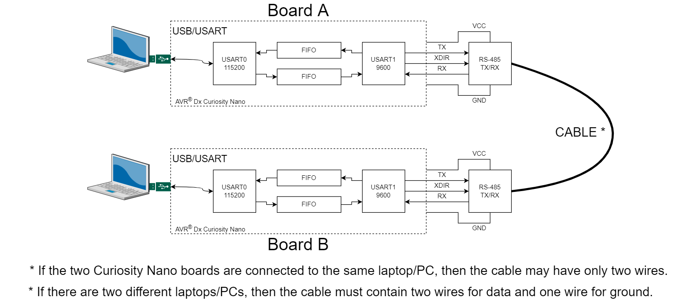
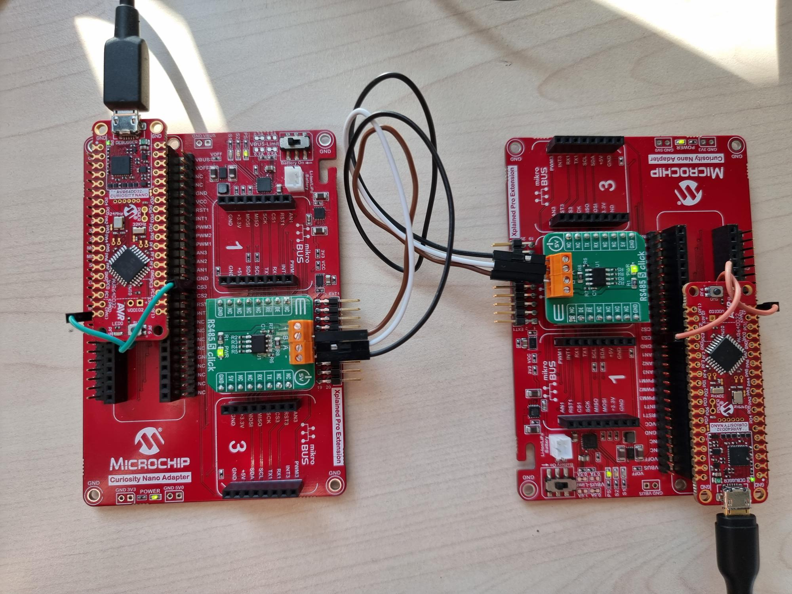
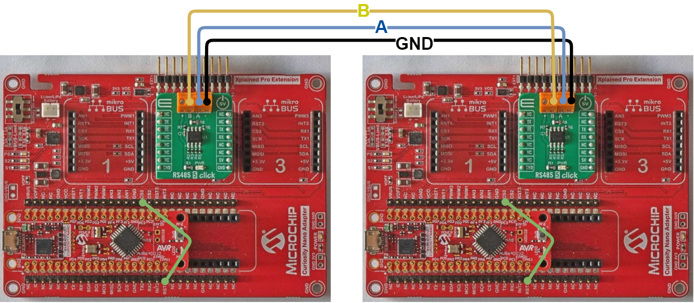
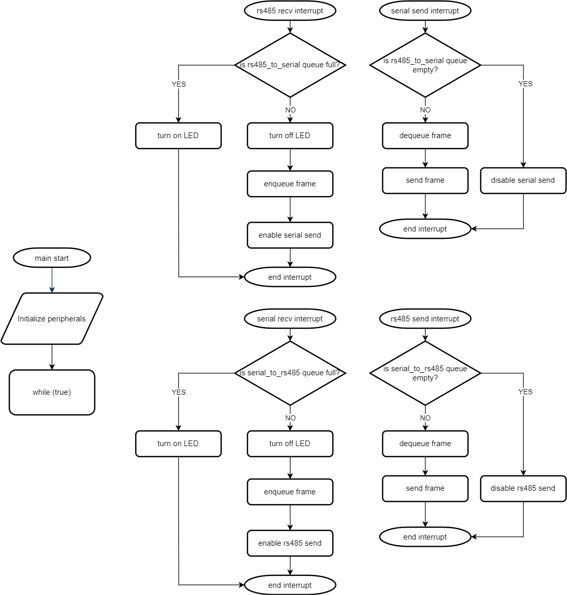
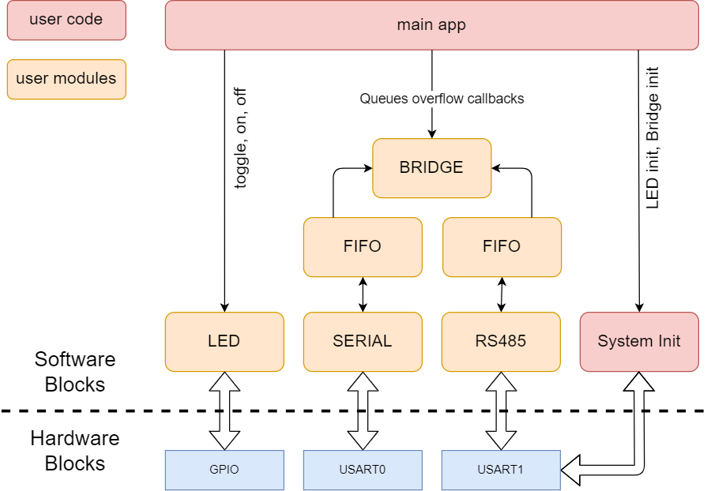
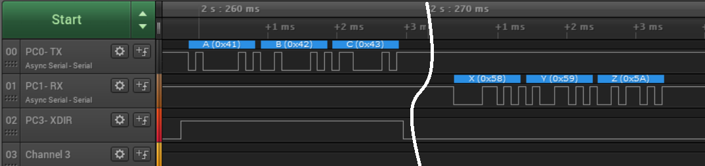

<!-- Please do not change this html logo with link -->

# Universal Synchronous and Asynchronous Receiver and Transmitter (USART) Configured in RS485 Mode Using the AVR64DD32 Microcontroller

The repository contains one MPLAB® X project:
1.  [Long-Distance Serial Communication Using USART in RS485 Mode](#1-long-distance-serial-communication-using-usart-in-rs485-mode) – This project bridges a serial communication at a fixed baud rate and RS485 communication at a lower baud rate. 

## Related Documentation

More details and code examples on the AVR64DD32 can be found at the following links:

- [AVR64DD32 Product Page](https://www.microchip.com/wwwproducts/en/AVR64DD32)
- [AVR64DD32 Code Examples on GitHub](https://github.com/microchip-pic-avr-examples?q=AVR64DD32)
- [AVR64DD32 Project Examples in START](https://start.atmel.com/#examples/AVR64DD32CuriosityNano)

## Software Used

- [MPLAB® X IDE](http://www.microchip.com/mplab/mplab-x-ide) v6.00 or newer
- [MPLAB® XC8](http://www.microchip.com/mplab/compilers) v2.36 or newer
- [AVR-Dx Series Device Pack](https://packs.download.microchip.com/) v2.1.152 or newer

## Hardware Used

- The AVR64DD32 Curiosity Nano Development board is used as a test platform
   
- [RS485 5 Click](https://www.mikroe.com/rs485-5-click)
- [Microchip Curiosity Nano Base for Click boards™](https://www.microchip.com/developmenttools/ProductDetails/AC164162)
- Jumper wires

## Operation

To program the Curiosity Nano board with this MPLAB® X project, follow the steps provided in the [How to Program the Curiosity Nano Board](#how-to-program-the-curiosity-nano-board) chapter. 

## 1. Long-Distance Serial Communication Using USART in RS485 Mode

This project bridges a serial communication at a fixed baud rate and a RS485 communication at a lower baud rate. The serial, connected to a host (such as a PC or another microcontroller/microprocessor) has a fixed baud rate of 115200 bits/second, while the RS485 baud rate must be adjusted based on the cables length. With longer cables, a lower baud rate is necessary for noise immunity. From the Host perspective, this setup resolves the baud rate errors.  

 **RS485 communication can go up to 1.2 km distance. The cable used consists of three wires: GND, DATA+ and DATA-.** 

Two Curiosity Nano boards are programmed with the firmware from this repository. The boards are connected to different computers, so they can send or receive bytes, using the USART peripheral. Each board has an external RS485 drive that uses a second USART instance configured in RS485 mode, allowing the boards to communicate through long cables.

 

### 1.1 Implementation Details

The provided firmware in this project bridges the two USART instances with different configurations. USART0 (SERIAL module) is set with the baud rate of 115200 and the USART1 (RS485 module) is set with the baud rate of 9600 in RS485 mode. When the SERIAL receives a byte, it is added to a queue and RS485 sends the byte from this queue. When RS485 receives a byte, it is added to a second queue and the SERIAL sends the byte from the second queue. 

Because the SERIAL module has a higher speed than the RS485, a byte is received when the queue is full. In this case, the LED turns on and will turn off when the queue has space for more elements.

### 1.2 Setup

The following picture shows how the two boards are connected:

 

The following picture shows the wiring diagram:
 

The following configurations must be made for this project:
- The system clock is 4 MHz
- USART0:
    - RX: Enabled
    - TX: Enabled
    - Parity Mode: No Parity
    - Stop Bit : 1
    - Character Size: 8 bits
    - Baud Rate: 115200
- USART1:
    - RX: Enabled
    - TX: Enabled
    - Parity Mode: No Parity
    - Stop Bit : 1
    - Character Size: 8 bits
    - Baud Rate: 9600
    - RS485 Mode: Enabled
- EVSYS:
    - CHANNEL2 input: pin PC3
    - CHANNEL2 output: USEREVSYSEVOUTC
    
**Note:** Connect a jumper wire between pin PA1 and pin PC3.

 |Pin                       | Configuration      |
 | :---------------------:  | :----------------: |
 |           PD4            |     SERIAL RX      |
 |           PD5            |     SERIAL TX      |
 |           PC0            |     RS485 TX       |
 |           PC1            |     RS485 RX       |
 |           PC3            |     RS485 XDIR     |
 |           PC2            |     CLICK RE       |
 |           PA1            |     CLICK DE       |

### 1.3 Project Flowchart and Block Diagram

The picture below shows the initialization process and the Interrupt Service Routines (ISRs) for the RX 485, TX serial, RX serial and TX 485: 
 

The block diagram below shows the interaction between the software blocks and the hardware blocks:  
 

### 1.4 Demo

In this demo, three different bytes are sent and received to show the XDIR pin that is automatically driven by the USART peripheral configured in RS485 mode.

  

 | Color |Pin  | Configuration | 
 | :---: | :-: | :-----------: |
 | BLACK | PC0 |       TX      |
 | BROWN | PC1 |       RX      |
 |  RED  | PC3 |      XDIR     |

### 1.5 Summary
The firmware is a bridge between two USART instances with different baud rates. It bridges a serial communication at a fixed baud rate and RS485 communication at a lower baud rate.

## How to Program the Curiosity Nano Board

This chapter shows how to use the MPLAB® X IDE to program an AVR® device with an Example_Project.X. This can be applied to any other projects.

- Connect the board to the PC

- Open the Example_Project.X project in MPLAB® X IDE

- Set the Example_Project.X project as main project

  - Right click the project in the **Projects** tab and click **Set as Main Project**.
     

- Clean and build the Example_Project.X project.

  - Right click the **Example_Project.X** project and select **Clean and Build**.
     

- Select **AVRxxxxx Curiosity Nano** in the Connected Hardware Tool section of the project settings:

  - Right click the project and click **Properties**
  - Click the arrow under the Connected Hardware Tool
  - Select **AVRxxxxx Curiosity Nano** (click the **SN**), click **Apply** and then click **OK**:
     

- Program the project to the board
  - Right click the project and click **Make and Program Device**.
     

 

- - -
## Menu

- [Back to 1. Long-Distance Serial Communication Using USART in RS485 Mode](#1-long-distance-serial-communication-using-usart-in-rs485-mode)
    - [Back to 1.1 Implementation Detail](#11-implementation-details)
    - [Back to 1.2 Setup](#12-setup)
    - [Back to 1.3 Project Flowchart and Block Diagram](#13-project-flowchart-and-block-diagram)
    - [Back to 1.4 Demo](#14-demo)
    - [Back to 1.5 Summary](#15-summary)
- [Back to top](#universal-synchronous-and-asynchronous-receiver-and-transmitter-usart-configured-in-rs485-mode-using-the-avr64dd32-microcontroller)

- - -
